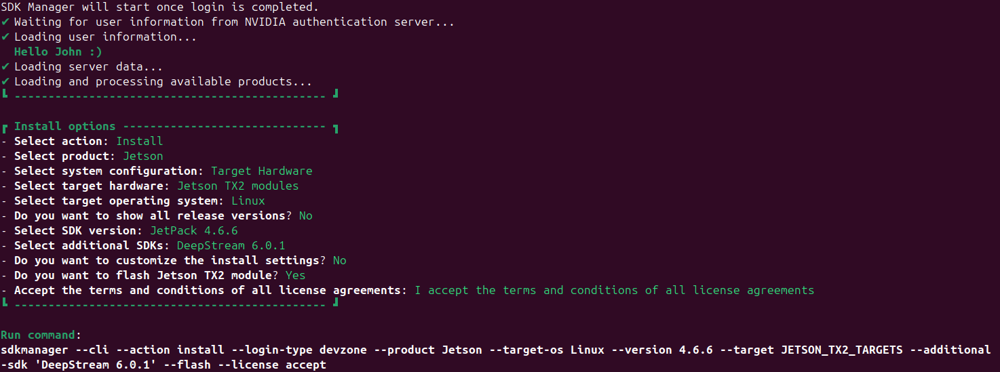

# 硬件扩展 - Jetson TX2

- OS: Ubuntu 24.04

## 硬件环境

因主机是 Ubuntu 24.04，故使用 SDK Manager 的 Docker Image Ubuntu 18.04 来安装 Jetson TX2 环境。

- [Jetson TX2 Developer Kit User Guide](https://developer.nvidia.com/embedded/dlc/jetson_tx2_developer_kit_user_guide)
- [Jetson Download Center](https://developer.nvidia.com/embedded/jetpack/downloads)
  - [NVIDIA SDK Manager](https://developer.nvidia.com/sdk-manager) is supported only on Ubuntu 16.04/18.04 for JetPack 4.x
- [Jetson Linux Archive](https://developer.nvidia.com/embedded/jetson-linux-archive)
  - [Jetson Linux R32.7.6](https://developer.nvidia.com/embedded/linux-tegra-r3276) is included as part of [JetPack 4.6.6](https://developer.nvidia.com/jetpack-sdk-466)

还可以：

- 虚拟机或硬盘上 Ubuntu 18.04，再用 SDK Manager 来安装
- 下载 BSP + rootfs 手动刷机，再安装 CUDA 等组件，步骤问 AI

### Docker 安装

连接板子，

- 用 Micro-USB 线连接主机与板子
  - 确保是支持数据传输的线，不然找不到板子
- 上电，并进入 Recovery 模式
  - Power 开机，REC 按住，RST 按一下，REC 等 2s 后释放
- lsusb 确认可找到 Nvidia 板子

```bash
$ lsusb | grep -i nvidia
Bus 001 Device 008: ID 0955:7c18 NVIDIA Corp. T186 [TX2 Tegra Parker] recovery mode
```

准备镜像，

```bash
docker load -i ./sdkmanager-2.4.0.13236-Ubuntu_18.04_docker.tar.gz
docker tag sdkmanager:2.4.0.13236-Ubuntu_18.04 sdkm:latest
```

安装 JetPack，

```bash
docker run -it --rm sdkm --help

# 下载目录映射到主机，可以断点继续
docker run -it --privileged \
-v /dev/bus/usb:/dev/bus/usb/ \
-v /dev:/dev \
-v /media/$USER:/media/nvidia:slave \
-v $HOME/Downloads:/home/nvidia/Downloads \
--network host \
sdkm --cli
```



<!--
docker run -it --rm --entrypoint /bin/bash sdkm

docker run -it --privileged \
-v /dev/bus/usb:/dev/bus/usb/ \
-v /dev:/dev \
-v /media/$USER:/media/nvidia:slave \
-v $HOME/Downloads:/home/nvidia/Downloads \
--network host \
--entrypoint /bin/bash \
sdkm

sdkmanager --cli
-->

同时进容器，

```bash
docker ps -a
docker exec -it <id> /bin/bash
```

安装如下依赖，

```bash
# avoid: 'dpkg': Exec format error
sudo apt update
sudo apt install -y qemu-user-static binfmt-support
sudo update-binfmts --enable
# ensure: enabled
cat /proc/sys/fs/binfmt_misc/qemu-aarch64
```

确认刷机时，OEM 配置建议选 Runtime，首次启动自己设置用户账户。

### 远程配置

SSH 登录，

```bash
# 用自己的用户名与 IP 地址
ssh john@192.168.199.117
```

安装 Vino，

```bash
sudo apt update
sudo apt install -y vino dconf-editor
```

启用 Vino，

```bash
# 修改配置
sudo nano /usr/share/glib-2.0/schemas/org.gnome.Vino.gschema.xml

# 在如下两行后
<schemalist>
  <schema id='org.gnome.Vino' path='/org/gnome/desktop/remote-access/'>
    # 添加如下内容
    <key name='enabled' type='b'>
      <summary>Enable remote access to the desktop</summary>
      <description>
        If true, allows remote access to the desktop via the RFB
        protocol. Users on remote machines may then connect to the
        desktop using a VNC viewer.
      </description>
      <default>false</default>
    </key>

# 让修改生效
sudo glib-compile-schemas /usr/share/glib-2.0/schemas
```

之后，即可从设置打开 Desktop Sharing 并启用。

或者，命令行设置，

```bash
# 设置 VNC
gsettings set org.gnome.Vino authentication-methods "['vnc']"
gsettings set org.gnome.Vino vnc-password $(echo -n 'password'|base64)

# 关闭提示
gsettings set org.gnome.Vino require-encryption false
gsettings set org.gnome.Vino prompt-enabled false

# 开机自启
mkdir -p ~/.config/autostart
cp /usr/share/applications/vino-server.desktop ~/.config/autostart/

# 重启系统
sudo reboot

# 检查生效
ps aux | grep vino
```

主机，则用 Remmina VNC 连接。

> 注: USB 连接的 L4T-README 盘里有 README-vnc.txt 等说明。

<!--
xrandr --fb 1280 800
-->

## 硬件连线

把 Robot 的 USB 接到 TX2，与 PC 一样。

## 软件环境

Jetson TX2 上 conda 用 miniforge 发行版，

```bash
wget "https://github.com/conda-forge/miniforge/releases/latest/download/Miniforge3-$(uname)-$(uname -m).sh"
bash Miniforge3-$(uname)-$(uname -m).sh
```

见『[准备/软件](../README.md)』，安装 Robot 环境。

但发现依赖问题，如 torch 版本达不到 LeRobot 要求。

故选择 [jetson-containers](https://github.com/dusty-nv/jetson-containers) 容器环境，再准备软件环境。

### 容器环境

安装 jetson-containers，

```bash
git clone --depth 1 https://github.com/dusty-nv/jetson-containers
bash jetson-containers/install.sh
```

依照 [System Setup](https://github.com/dusty-nv/jetson-containers/blob/master/docs/setup.md) 配置 Docker daemon 等。

PyTorch 环境，

```bash
jetson-containers run $(autotag l4t-pytorch)
# 若挂载主机目录
jetson-containers run $(autotag l4t-pytorch) -v $HOME/Codes:/home/codes
```

ROS2 环境，

```bash
jetson-containers run $(autotag ros:foxy-pytorch-l4t)
# 若挂载主机目录
docker run -it --name ros \
-v $HOME/Codes:/home/codes \
dustynv/ros:foxy-pytorch-l4t-r32.7.1

# 检查环境
$ python3 - <<-EOF
import platform
import torch
print(f" Python: {platform.python_version()}")
print(f"PyTorch: {torch.__version__}")
print(f"   CUDA: {torch.version.cuda} en={torch.cuda.is_available()}")
EOF
 Python: 3.6.9
PyTorch: 1.10.0
   CUDA: 10.2 en=True
```
<!--
docker start ros
docker exec -it ros bash
-->
更多参考 [jetbot_ros](https://github.com/dusty-nv/jetbot_ros)。

安装 ffmpeg，

```bash
apt update -y
apt install -y ffmpeg
```
