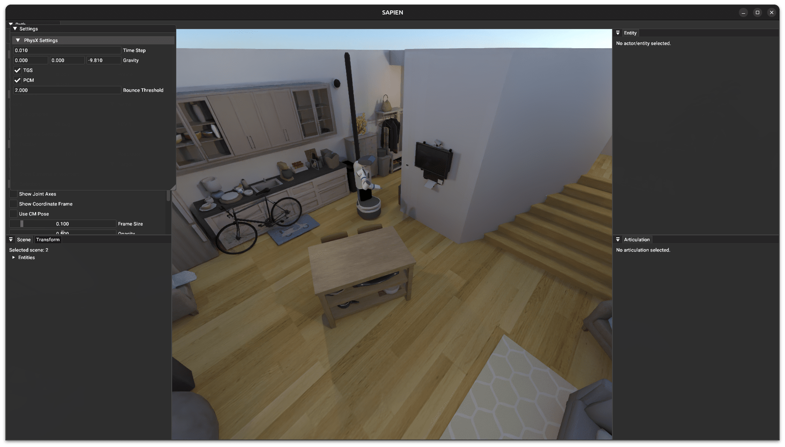
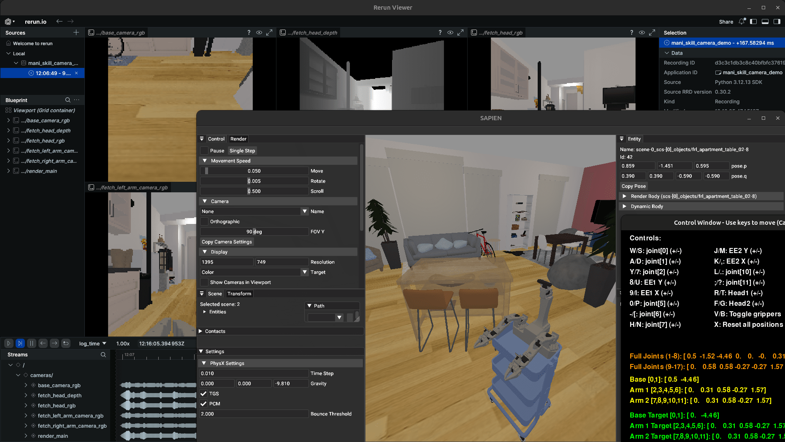

# ManiSkill 仿真

- OS: Ubuntu 24.04

## 创建 Conda 环境

- [Miniconda](https://www.anaconda.com/docs/getting-started/miniconda/install)

```bash
conda create -n lerobot python=3.12
conda activate lerobot

# 额外依赖
pip install pygame rerun-sdk
```

## 安装 ManiSkill

- [Installation of ManiSkill](https://maniskill.readthedocs.io/en/latest/user_guide/getting_started/installation.html)

```bash
# 安装 PyTorch（CUDA 版本不高于 nvidia-smi 显示的）
#  https://pytorch.org/get-started/locally
pip install torch torchvision --index-url https://download.pytorch.org/whl/cu130

# 安装 ManiSkill
pip install --upgrade mani_skill

# 安装验证 ✓
$ python - <<-EOF
import platform
import torch
import mani_skill
print(f"   Python: {platform.python_version()}")
print(f"  PyTorch: {torch.__version__}")
print(f"     CUDA: {torch.version.cuda} en={torch.cuda.is_available()}")
print(f"ManiSkill: {mani_skill.__version__}")
EOF
   Python: 3.12.13
  PyTorch: 2.10.0+cu130
     CUDA: 13.0 en=True
ManiSkill: 3.0.0b22
```

ManiSkill 有两环境变量（暂不动），

```bash
# ManiSkill 资源目录
export MS_ASSET_DIR=~/.maniskill/data
# ManiSkill 资源下载是否跳过
export MS_SKIP_ASSET_DOWNLOAD_PROMPT=1
```

ManiSkill 功能验证，

```bash
# 下载场景数据集
# unset all_proxy ALL_PROXY
python -m mani_skill.utils.download_asset "ReplicaCAD"

# 测试场景
python -m mani_skill.examples.demo_random_action \
-e "ReplicaCAD_SceneManipulation-v1" \
--render-mode="human" \
--shader="rt-fast"
```



## 加入 XLeRobot

<!--
nautilus ~/miniconda3/envs/lerobot/lib/python3.12/site-packages/mani_skill
-->

```bash
# 获取 XLeRobot 源码
git clone git@github.com:Vector-Wangel/XLeRobot.git
export XR_DIR=`pwd`/XLeRobot

# 设定 ManiSkill 目录
export MS_DIR=~/miniconda3/envs/lerobot/lib/python3.12/site-packages/mani_skill

# 软链接 XLeRobot 资源
#  注意：ManiSkill 最新可能存在 xlerobot，可以移动备份后再链接
ln -s $XR_DIR/simulation/Maniskill/agents/xlerobot $MS_DIR/agents/robots/xlerobot
ln -s $XR_DIR/simulation/Maniskill/assets/xlerobot $MS_DIR/assets/robots/xlerobot
ln -s $XR_DIR/simulation/Maniskill/envs/scenes/base_env.py $MS_DIR/envs/scenes/base_env.py
ln -s $XR_DIR/simulation/Maniskill/examples/* $MS_DIR/examples/

# 加入 XLeRobot
# > __init__.py 末尾添加引用
#  form .xlerobot import *
vi $MS_DIR/agents/robots/__init__.py
# > scene_builder.py 添加 xlerobot 进 ReplicaCAD 场景
#  # teleport robot back to correct location
#  if self.env.robot_uids in ("fetch", "xlerobot", "xlerobot_single"):
vi $MS_DIR/utils/scene_builder/replicacad/scene_builder.py
```

## 开始运行

> 将 `shader=”default”` 更改为 `”rt-fast”` 以获得照片级真实感光线追踪渲染(但更慢)。

### 关节控制

```bash
python -m mani_skill.examples.demo_ctrl_action -e "ReplicaCAD_SceneManipulation-v1" -r "xlerobot"  --render-mode="human" --shader="default" -c "pd_joint_delta_pos_dual_arm"
```

### 末端执行器控制

原始双臂版本：

```bash
python -m mani_skill.examples.demo_ctrl_action_ee_keyboard -e "ReplicaCAD_SceneManipulation-v1" -r "xlerobot"  --render-mode="human" --shader="default" -c "pd_joint_delta_pos_dual_arm"
```

<!--
单臂版本：

```bash
python -m mani_skill.examples.demo_ctrl_action_ee_keyboard_single -e "ReplicaCAD_SceneManipulation-v1" -r "xlerobot_single"  --render-mode="human" --shader="default" -c "pd_joint_delta_pos"
```
-->

通过 Rerun 进行相机可视化：

```bash
python -m mani_skill.examples.demo_ctrl_action_ee_cam_rerun -e "ReplicaCAD_SceneManipulation-v1" -r "xlerobot"  --render-mode="human" --shader="default" -c "pd_joint_delta_pos_dual_arm"
```


