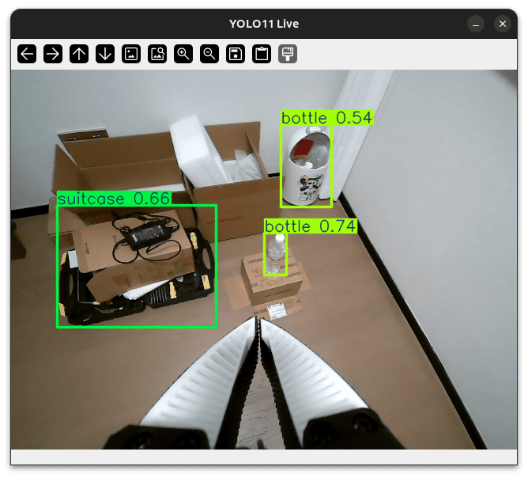

# 手臂控制

- OS: Ubuntu 24.04

```bash
conda activate lerobot
cd lerobot
```

## 键盘关节控制

```bash
python examples/0_so100_keyboard_joint_control.py
```

键盘控制指令，

```bash
Keyboard control instructions:
- Q/A: Joint1 (shoulder_pan) decrease/increase
- W/S: Joint2 (shoulder_lift) decrease/increase
- E/D: Joint3 (elbow_flex) decrease/increase
- R/F: Joint4 (wrist_flex) decrease/increase
- T/G: Joint5 (wrist_roll) decrease/increase
- Y/H: Joint6 (gripper) decrease/increase
- X: Exit program (first return to start position)
- ESC: Exit program
```

## 末端位置控制

```bash
python examples/1_so100_keyboard_ee_control.py
```

## 双臂键盘控制

```bash
python examples/2_dual_so100_keyboard_ee_control.py
```

## 末端物体追踪

```bash
pip install -U ultralytics
# 独立控制
python examples/3_so100_yolo_ee_control.py
# 物体追踪
python examples/3_so100_yolo_ee_follow.py
```



## 更多资料

- [手臂标定](https://huggingface.co/docs/lerobot/so101#calibrate)

## 问题：控制不了？

若遇如下错误，可能只是没开电源 ==：

```bash
Please enter SO100 robot USB port (e.g.: /dev/ttyACM0): /dev/ttyACM1
Connecting to port: /dev/ttyACM1
Program execution failed: FeetechMotorsBus motor check failed on port '/dev/ttyACM1':

Missing motor IDs:
  - 1 (expected model: 777)
  - 2 (expected model: 777)
  - 3 (expected model: 777)
  - 4 (expected model: 777)
  - 5 (expected model: 777)
  - 6 (expected model: 777)

Full expected motor list (id: model_number):
{1: 777, 2: 777, 3: 777, 4: 777, 5: 777, 6: 777}

Full found motor list (id: model_number):
{}
```

不然，得依照[这里](https://huggingface.co/docs/lerobot/so101#configure-the-motors)配置双臂的舵机：

```bash
lerobot-find-port

lerobot-setup-motors \
--robot.type=so101_follower \
--robot.port=/dev/ttyACM0

lerobot-setup-motors \
--robot.type=so101_leader \
--robot.port=/dev/ttyACM1
```

## 问题：显示不了？

```bash
Video stream error: OpenCV(4.13.0) /io/opencv/modules/highgui/src/window.cpp:1301: error: (-2:Unspecified error) The function is not implemented. Rebuild the library with Windows, GTK+ 2.x or Cocoa support. If you are on Ubuntu or Debian, install libgtk2.0-dev and pkg-config, then re-run cmake or configure script in function 'cvShowImage'

Video stream ended
Exception in thread Thread-2 (video_stream_loop):
Traceback (most recent call last):
  File "/home/john/miniconda3/envs/lerobot/lib/python3.12/threading.py", line 1075, in _bootstrap_inner
    self.run()
  File "/home/john/miniconda3/envs/lerobot/lib/python3.12/threading.py", line 1012, in run
    self._target(*self._args, **self._kwargs)
  File "/home/john/Codes/Self/nebul/lerobot/examples/3_so100_yolo_ee_control.py", line 284, in video_stream_loop
    cv2.destroyAllWindows()
cv2.error: OpenCV(4.13.0) /io/opencv/modules/highgui/src/window.cpp:1295: error: (-2:Unspecified error) The function is not implemented. Rebuild the library with Windows, GTK+ 2.x or Cocoa support. If you are on Ubuntu or Debian, install libgtk2.0-dev and pkg-config, then re-run cmake or configure script in function 'cvDestroyAllWindows'
```

安装一下依赖，

```bash
sudo apt-get install libgtk2.0-dev pkg-config

pip uninstall opencv-python
pip install opencv-python
```
